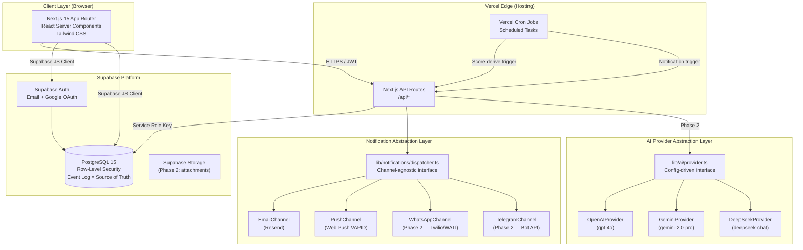
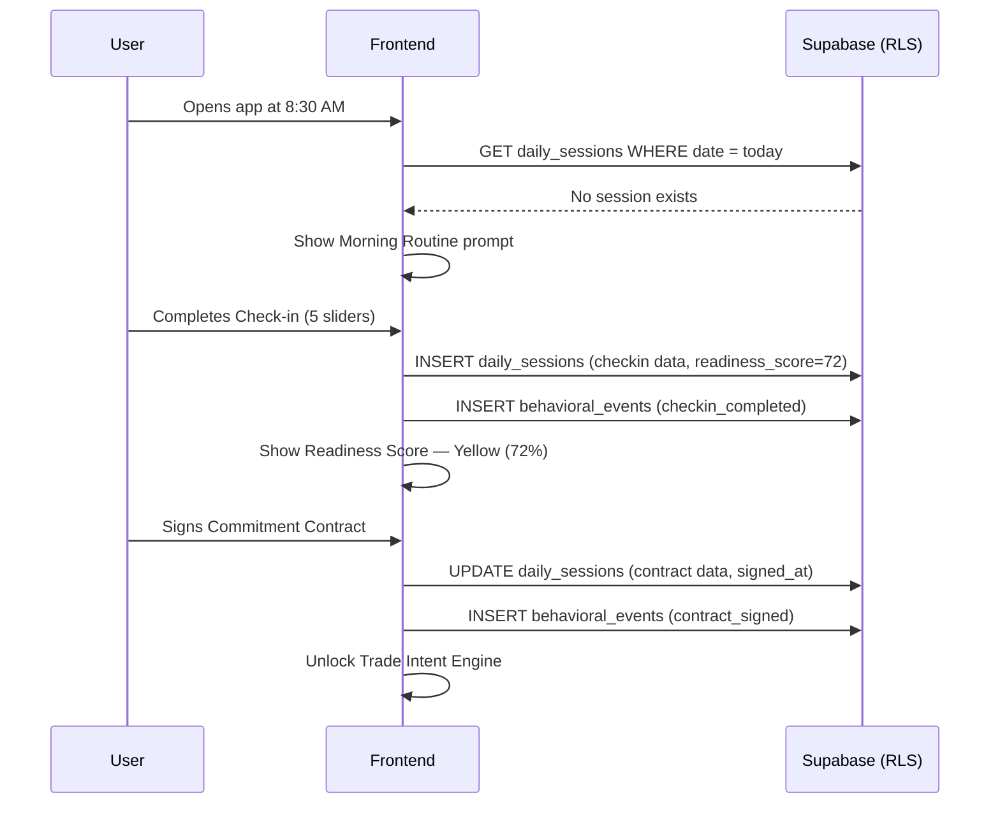
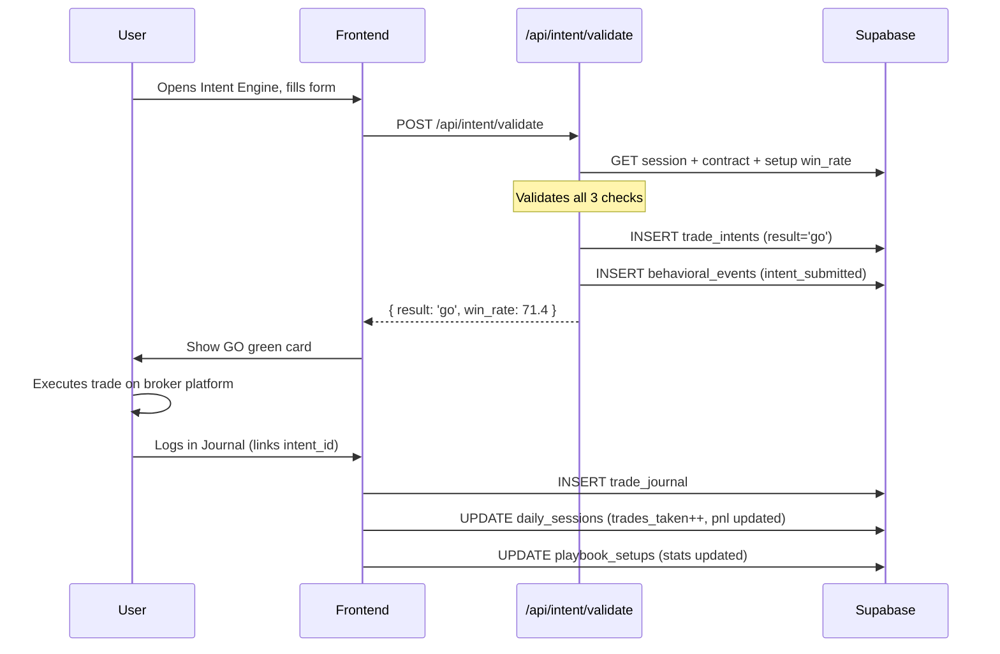
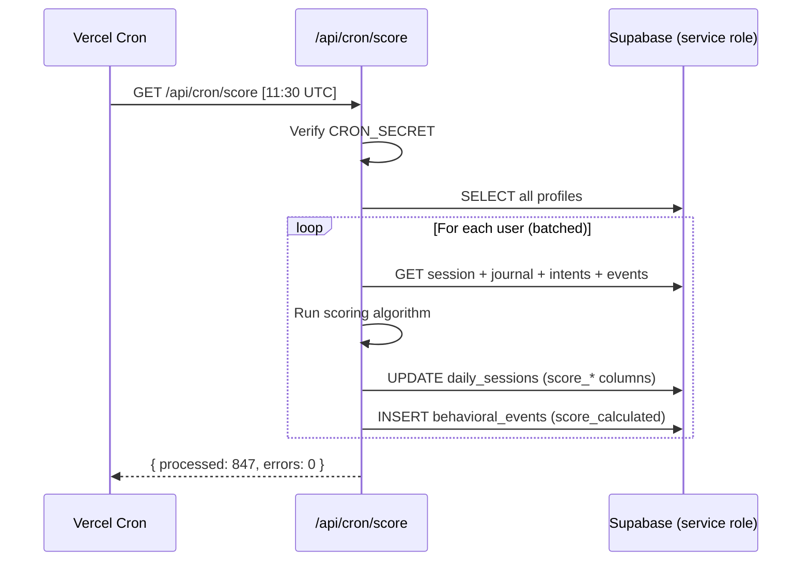

# TradingOS — Technical Architecture Document (TAD)
**Version:** 1.1 | **Date:** June 2026 | **Status:** APPROVED FOR DEVELOPMENT  
**Prepared by:** Principal SaaS Architect  
**Based on:** TradingOS PRD v1.0  
**Stack:** Next.js 15 · Supabase · PostgreSQL · Tailwind CSS · Vercel

> **Changelog v1.1:** Three architectural upgrades applied — (1) AI Provider Abstraction Layer replaces GPT-4o hard-dependency; (2) Discipline Score rewritten as Event-Sourced derivation; (3) Notification Engine redesigned with Channel Abstraction Layer.

---

## Table of Contents

1. [System Architecture Diagram](#1-system-architecture-diagram)
2. [Frontend Architecture](#2-frontend-architecture)
3. [Backend Architecture](#3-backend-architecture)
4. [Database Schema](#4-database-schema)
5. [Authentication Design](#5-authentication-design)
6. [Trade Intent Engine Design](#6-trade-intent-engine-design)
7. [Discipline Score Engine Design](#7-discipline-score-engine-design)
8. [Notification Engine Design](#8-notification-engine-design)
9. [AI Coach Architecture (Phase 2)](#9-ai-coach-architecture-phase-2)
10. [Security & RLS Policies](#10-security--rls-policies)
11. [API Design](#11-api-design)
12. [Event Flows](#12-event-flows)
13. [Scalability Considerations](#13-scalability-considerations)
14. [Deployment Architecture](#14-deployment-architecture)
15. [Cost Estimates](#15-cost-estimates)
16. [Architecture Decision Records (ADRs)](#16-architecture-decision-records-adrs)

---

## 1. System Architecture Diagram

### High-Level System Map



### Request Flow Summary

| Layer | Technology | Responsibility |
|---|---|---|
| Client | Next.js 15 + React | UI rendering, client-side state, Supabase SDK calls |
| API Routes | Next.js `/app/api/` | Business logic, score derivation, external API calls |
| Auth | Supabase Auth | Session management, JWT issuance, OAuth |
| Database | PostgreSQL + RLS | All persistent data; `behavioral_events` is the authoritative score source |
| Cron | Vercel Cron | Scheduled score derivation, notification triggers |
| Notification Layer | `lib/notifications/dispatcher.ts` | Channel-agnostic dispatch (Email, Push, WhatsApp, Telegram) |
| AI Layer | `lib/ai/provider.ts` | Config-driven LLM provider (OpenAI, Gemini, DeepSeek) |

---

## 2. Frontend Architecture

### ADR Reference: See ADR-01, ADR-02

### Stack

- **Framework:** Next.js 15 (App Router)
- **Styling:** Tailwind CSS v3
- **State Management:** Zustand (client-side) + React Server Components (server-side data)
- **Data Fetching:** Supabase JS client in Server Components (no extra fetch layer needed)
- **Forms:** React Hook Form + Zod validation
- **Charts:** Recharts (lightweight, no D3 dependency)
- **Notifications:** browser-native Web Push API

### Directory Structure

```
/app
  /                         → Dashboard (protected)
  /auth
    /login                  → Login page
    /signup                 → Registration
    /callback               → OAuth callback handler
  /onboarding
    /profile                → Step 1: Risk profile
    /playbook               → Step 2: Playbook setup
    /complete               → Onboarding done
  /checkin                  → Morning Psychological Check-in
  /contract                 → Daily Commitment Contract
  /intent                   → Trade Intent Engine
  /journal
    /new                    → Log new trade
    /[date]                 → View trades by date
  /score                    → Discipline Score history
  /settings                 → User preferences, notifications
  /api
    /intent/validate        → POST: Trade Intent validation
    /score/calculate        → POST: Trigger score calculation
    /score/[date]           → GET: Score for a specific date
    /notifications/send     → POST: Send scheduled notification
    /notifications/subscribe → POST: Register push subscription
    /cron/score             → GET: Vercel Cron — daily score job
    /cron/notify            → GET: Vercel Cron — notification job

/components
  /ui                       → Shared primitives (Button, Card, Badge, Slider)
  /dashboard                → DashboardCard, ScoreGauge, TradeCounter
  /checkin                  → ReadinessSlider, ReadinessResult
  /intent                   → IntentForm, ValidationResult
  /journal                  → TradeForm, TradeList, PsychTag
  /score                    → ScoreBreakdown, ScoreChart, PillarCard
  /playbook                 → SetupCard, SetupForm
  /notifications             → PushPermissionBanner

/lib
  /supabase
    /client.ts              → Browser-side Supabase client
    /server.ts              → Server-side Supabase client (service role)
  /score-engine.ts          → Score calculation logic (pure functions)
  /intent-engine.ts         → Intent validation logic (pure functions)
  /notifications.ts         → Web push + email utilities
  /constants.ts             → IST timezone, score weights, psychology tags
  /types.ts                 → TypeScript type definitions (mirrors DB schema)

/middleware.ts               → Auth guard — redirects unauthenticated users
```

### Routing Strategy

- **Protected routes:** Middleware checks Supabase session. Unauthenticated → redirect to `/auth/login`.
- **Onboarding guard:** If `profiles.onboarding_completed = false`, redirect to `/onboarding/profile` regardless of route.
- **Server Components by default:** Only opt into `"use client"` for interactive components (forms, charts, sliders).

### Tailwind Design Tokens

```
Colors (dark theme — mandatory for trading context):
  --brand-primary:   #6366f1  (Indigo — discipline, trust)
  --brand-accent:    #f59e0b  (Amber — warnings, caution)
  --success:         #22c55e  (Green — GO signal)
  --danger:          #ef4444  (Red — NO-GO, alerts)
  --surface:         #0f172a  (Near-black background)
  --surface-raised:  #1e293b  (Card surfaces)
  --muted:           #64748b  (Secondary text)

Typography:
  Font: Inter (Google Fonts)
  Scale: 12/14/16/20/24/32px

Spacing: 4px base unit (Tailwind default)
```

> [!NOTE]
> Dark theme is mandatory from Day 1. Traders use TradingOS on screens during market hours — dark mode reduces eye strain and feels premium. Do not ship a light-only theme.

---

## 3. Backend Architecture

### ADR Reference: See ADR-03, ADR-04

### Philosophy: Supabase-First, API Routes for Logic Only

> [!IMPORTANT]
> Do NOT replicate Supabase capabilities in API routes. Direct client-to-Supabase calls (with RLS) handle all CRUD. API Routes are ONLY for:
> 1. Business logic requiring server-side computation (score derivation from events, intent validation)
> 2. External service calls via abstraction layers (Notification Dispatcher, AI Provider)
> 3. Cron job endpoints

This eliminates an entire backend service layer. A solo founder cannot maintain two codebases.

### API Route Responsibilities

```
Client → Supabase SDK (RLS-protected)         = All CRUD operations
Client → /api/intent/validate                 = Intent Engine validation logic
Cron   → /api/cron/score                      = Daily score derivation from event log
Cron   → /api/cron/notify                     = Notification dispatch (via abstraction)
Client → /api/notifications/subscribe         = Register push subscription
/api/  → lib/notifications/dispatcher.ts      = Channel-agnostic notification dispatch
/api/  → lib/ai/provider.ts (Phase 2)         = Config-driven AI Coach reports
```

### Environment Variables Required

```bash
# Supabase
NEXT_PUBLIC_SUPABASE_URL=
NEXT_PUBLIC_SUPABASE_ANON_KEY=
SUPABASE_SERVICE_ROLE_KEY=        # Server-only, never expose to client

# Cron security
CRON_SECRET=                      # Secret token for Vercel Cron auth

# App
NEXT_PUBLIC_APP_URL=
NEXT_PUBLIC_IST_OFFSET=330        # UTC+5:30 in minutes

# ─── Notification Channels (add as channels are activated) ────────────────
RESEND_API_KEY=                   # Email channel — active MVP
VAPID_PUBLIC_KEY=                 # Push channel — active MVP
VAPID_PRIVATE_KEY=
VAPID_EMAIL=
TWILIO_WHATSAPP_SID=              # WhatsApp channel — Phase 2
TWILIO_WHATSAPP_TOKEN=
TELEGRAM_BOT_TOKEN=               # Telegram channel — Phase 2

# ─── AI Provider (set ONE active provider + key) ──────────────────────────
AI_PROVIDER=openai                # 'openai' | 'gemini' | 'deepseek'
OPENAI_API_KEY=                   # Active if AI_PROVIDER=openai
GEMINI_API_KEY=                   # Active if AI_PROVIDER=gemini
DEEPSEEK_API_KEY=                 # Active if AI_PROVIDER=deepseek
```

---

## 4. Database Schema

### ADR Reference: See ADR-05

### Design Principles

1. **UUIDs everywhere** — stable references across all tables
2. **All timestamps in UTC** — application layer converts to IST for display
3. **Soft deletes only** — `archived_at` column, never physical DELETE
4. **Event Sourcing for Discipline Score** — `behavioral_events` is the append-only source of truth; the score is always *derived*, never *stored as a mutable number*. The `score_total` column in `daily_sessions` is a **read-model cache** (materialized view of events), not the system of record.
5. **Immutability on trade_journal** — enforced via database trigger (no UPDATE after 24 hours)
6. **Behavioral event log as foundation** — every user action appends a row to `behavioral_events`; AI Coach, Score Engine, and escalation logic all read from this single source

> [!IMPORTANT]
> **Event Sourcing benefit:** If the scoring algorithm changes tomorrow (e.g., add a new pillar, change weights), you can re-derive the correct historical score for every user from the existing event log — with zero data migration. A stored `score = 82` is a dead end. An event log is a living audit trail.

---

### Table: `profiles`

Extends Supabase `auth.users`. One row per user.

```sql
CREATE TABLE profiles (
  id                    UUID PRIMARY KEY REFERENCES auth.users(id) ON DELETE CASCADE,
  email                 TEXT NOT NULL,
  full_name             TEXT,

  -- Trading Profile
  capital_base          NUMERIC(12,2) NOT NULL DEFAULT 0,
  market_type           TEXT NOT NULL CHECK (market_type IN ('equity','fo','crypto','commodity')),
  trading_style         TEXT NOT NULL CHECK (trading_style IN ('scalping','intraday','swing')),

  -- Default Risk Parameters
  default_risk_per_trade    NUMERIC(10,2) NOT NULL DEFAULT 0,
  default_daily_loss_limit  NUMERIC(10,2) NOT NULL DEFAULT 0,
  default_max_trades        INTEGER NOT NULL DEFAULT 3,

  -- Subscription
  tier                  TEXT NOT NULL DEFAULT 'free' CHECK (tier IN ('free','pro','teams')),
  tier_expires_at       TIMESTAMPTZ,

  -- Notification Preferences
  notification_prefs    JSONB NOT NULL DEFAULT '{
    "morning_checkin":       {"enabled": true, "time_ist": "08:30"},
    "market_open_warning":   {"enabled": true, "time_ist": "09:00"},
    "journal_reminder":      {"enabled": true, "time_ist": "16:00"},
    "journal_warning":       {"enabled": true, "time_ist": "17:00"},
    "evening_planning":      {"enabled": true, "time_ist": "20:00"}
  }',

  -- Push Subscription
  push_subscription     JSONB,

  -- State
  onboarding_completed  BOOLEAN NOT NULL DEFAULT FALSE,
  created_at            TIMESTAMPTZ NOT NULL DEFAULT NOW(),
  updated_at            TIMESTAMPTZ NOT NULL DEFAULT NOW()
);
```

---

### Table: `playbook_setups`

Trader's defined edge — the rule book.

```sql
CREATE TABLE playbook_setups (
  id              UUID PRIMARY KEY DEFAULT gen_random_uuid(),
  user_id         UUID NOT NULL REFERENCES profiles(id) ON DELETE CASCADE,

  name            TEXT NOT NULL,
  entry_conditions TEXT NOT NULL,
  timeframe       TEXT NOT NULL,
  min_rr_ratio    NUMERIC(4,2) NOT NULL DEFAULT 1.5,
  filters         JSONB,
  notes           TEXT,

  -- Stats updated by trigger after each trade_journal insert
  total_trades    INTEGER NOT NULL DEFAULT 0,
  winning_trades  INTEGER NOT NULL DEFAULT 0,

  -- Lifecycle
  is_active       BOOLEAN NOT NULL DEFAULT TRUE,
  archived_at     TIMESTAMPTZ,
  created_at      TIMESTAMPTZ NOT NULL DEFAULT NOW(),
  updated_at      TIMESTAMPTZ NOT NULL DEFAULT NOW()
);
-- win_rate = winning_trades / NULLIF(total_trades, 0) * 100 (computed, not stored)
```

---

### Table: `daily_sessions`

One row per user per trading day. The anchor for all daily activity.

```sql
CREATE TABLE daily_sessions (
  id              UUID PRIMARY KEY DEFAULT gen_random_uuid(),
  user_id         UUID NOT NULL REFERENCES profiles(id) ON DELETE CASCADE,
  session_date    DATE NOT NULL,

  -- Morning Check-in
  checkin_sleep       INTEGER CHECK (checkin_sleep BETWEEN 1 AND 10),
  checkin_stress      INTEGER CHECK (checkin_stress BETWEEN 1 AND 10),
  checkin_energy      INTEGER CHECK (checkin_energy BETWEEN 1 AND 10),
  checkin_focus       INTEGER CHECK (checkin_focus BETWEEN 1 AND 10),
  checkin_motivation  INTEGER CHECK (checkin_motivation BETWEEN 1 AND 10),
  readiness_score     INTEGER,
  checkin_completed_at TIMESTAMPTZ,

  -- Commitment Contract
  contract_max_trades          INTEGER,
  contract_max_loss_inr        NUMERIC(10,2),
  contract_allowed_setup_ids   UUID[],
  contract_forbidden_conditions TEXT,
  contract_signed_at           TIMESTAMPTZ,

  -- Daily Aggregates (updated after each trade)
  trades_taken        INTEGER NOT NULL DEFAULT 0,
  realized_pnl_inr    NUMERIC(12,2) NOT NULL DEFAULT 0,

  -- Discipline Score READ MODEL (cache derived from behavioral_events)
  -- These columns are populated by the score derivation cron.
  -- They are NEVER the source of truth. behavioral_events is.
  -- If the algorithm changes, drop these values and re-derive from events.
  score_total              INTEGER,        -- Cached derived score (0-100)
  score_checkin_pillar     INTEGER,        -- Cached pillar breakdown
  score_journal_pillar     INTEGER,
  score_playbook_pillar    INTEGER,
  score_no_revenge_pillar  INTEGER,
  score_evening_pillar     INTEGER,
  score_algorithm_version  TEXT,           -- e.g. 'v1.2' — tracks which algo produced this cache
  score_derived_at         TIMESTAMPTZ,    -- When this cache was last derived

  is_trading_day      BOOLEAN NOT NULL DEFAULT TRUE,
  created_at          TIMESTAMPTZ NOT NULL DEFAULT NOW(),
  updated_at          TIMESTAMPTZ NOT NULL DEFAULT NOW(),

  UNIQUE(user_id, session_date)
);
```

> [!NOTE]
> The `score_*` columns in `daily_sessions` are a **materialized read-model** — like a pre-computed view. They exist purely for dashboard query performance. The canonical score is always re-derivable by replaying `behavioral_events`. A cron invalidates and re-derives this cache whenever the algorithm version changes.

---

### Table: `trade_intents`

Every Trade Intent Engine submission — immutable audit log.

```sql
CREATE TABLE trade_intents (
  id              UUID PRIMARY KEY DEFAULT gen_random_uuid(),
  user_id         UUID NOT NULL REFERENCES profiles(id),
  session_id      UUID NOT NULL REFERENCES daily_sessions(id),
  setup_id        UUID REFERENCES playbook_setups(id),

  -- User Input
  risk_amount_inr NUMERIC(10,2) NOT NULL,
  rr_ratio        NUMERIC(4,2) NOT NULL,
  notes           TEXT,

  -- Engine Output
  validation_result   TEXT NOT NULL CHECK (validation_result IN ('go','caution','no_go')),
  validation_reasons  JSONB NOT NULL,
  win_rate_at_time    NUMERIC(5,2),

  -- Override tracking
  user_proceeded      BOOLEAN,
  override_reason     TEXT,

  submitted_at    TIMESTAMPTZ NOT NULL DEFAULT NOW()
  -- No updated_at — append-only
);
```

---

### Table: `trade_journal`

Immutable post-trade log.

```sql
CREATE TABLE trade_journal (
  id              UUID PRIMARY KEY DEFAULT gen_random_uuid(),
  user_id         UUID NOT NULL REFERENCES profiles(id),
  session_id      UUID NOT NULL REFERENCES daily_sessions(id),
  intent_id       UUID REFERENCES trade_intents(id),
  setup_id        UUID REFERENCES playbook_setups(id),

  -- Trade Data
  instrument      TEXT,
  entry_price     NUMERIC(12,4) NOT NULL,
  exit_price      NUMERIC(12,4) NOT NULL,
  quantity        NUMERIC(12,4) NOT NULL,
  pnl_inr        NUMERIC(12,2) NOT NULL,

  -- Behavioral Data
  psychology_tag  TEXT NOT NULL CHECK (psychology_tag IN (
                    'focus','confident','fomo','fear','greed','revenge','restlessness'
                  )),
  rule_followed   BOOLEAN NOT NULL DEFAULT TRUE,
  deviation_note  TEXT,
  notes           TEXT,

  logged_at       TIMESTAMPTZ NOT NULL DEFAULT NOW(),
  locked_at       TIMESTAMPTZ
);

-- Trigger: prevent updates after 24 hours
CREATE OR REPLACE FUNCTION prevent_journal_update()
RETURNS TRIGGER AS $$
BEGIN
  IF OLD.locked_at IS NOT NULL THEN
    RAISE EXCEPTION 'Trade journal entry is locked and cannot be modified.';
  END IF;
  RETURN NEW;
END;
$$ LANGUAGE plpgsql;

CREATE TRIGGER lock_journal_entries
  BEFORE UPDATE ON trade_journal
  FOR EACH ROW EXECUTE FUNCTION prevent_journal_update();
```

---

### Table: `behavioral_events`

Append-only event log. Powers Phase 2 AI Coach. Built from Day 1.

```sql
CREATE TABLE behavioral_events (
  id              UUID PRIMARY KEY DEFAULT gen_random_uuid(),
  user_id         UUID NOT NULL REFERENCES profiles(id),
  session_id      UUID REFERENCES daily_sessions(id),

  event_type      TEXT NOT NULL,
  metadata        JSONB NOT NULL DEFAULT '{}',

  occurred_at     TIMESTAMPTZ NOT NULL DEFAULT NOW()
  -- No updates, no deletes — append only
);

-- ═══════════════════════════════════════════════════════════════
-- EVENT TYPE REGISTRY — These events ARE the Discipline Score.
-- Score = f(events). Events never change. Algorithm can always change.
-- ═══════════════════════════════════════════════════════════════

-- SCORE INPUT EVENTS (each maps to a scoring pillar)
-- 'checkin_completed'         | {readiness_score: 72, completed_at_ist: '08:45'}
--   → Pillar: Check-in. Late if completed_at_ist > '11:00' → half points.

-- 'contract_signed'           | {max_trades: 3, max_loss: 3000, setup_ids: [...]}
--   → Pillar: Check-in (contract gate). Required for full pillar score.

-- 'trade_logged'              | {pnl: -1200, tag: 'revenge', rule_followed: false, setup_id: '...'}
--   → Pillar: Journal (+pts per trade logged), Revenge (-pts if tag='revenge'),
--             Playbook (-pts if rule_followed=false)

-- 'intent_submitted'          | {result: 'go', setup_id: '...', win_rate: 71}
--   → Pillar: Playbook (intent engine used = compliance credit)

-- 'intent_override'           | {original_result: 'no_go', reason: 'felt confident'}
--   → Pillar: Playbook (-10 pts per override of NO_GO)

-- 'evening_activity'          | {activity_type: 'blueprint_saved' | 'reflection_saved'}
--   → Pillar: Evening Planning (+10 pts)

-- OPERATIONAL EVENTS (logged for AI Coach context, not directly scored)
-- 'score_derived'             | {total: 78, pillars: {...}, algorithm_version: 'v1.2'}
-- 'notification_sent'         | {type: 'morning_checkin', channel: 'email'}
-- 'notification_delivered'    | {type: 'morning_checkin', channel: 'push'}
-- 'contract_limit_breached'   | {breach_type: 'loss_limit', amount: 3200}
-- 'checkin_skipped'           | {reason: 'market_holiday'}
```

---

### Table: `push_subscriptions`

```sql
CREATE TABLE push_subscriptions (
  id              UUID PRIMARY KEY DEFAULT gen_random_uuid(),
  user_id         UUID NOT NULL REFERENCES profiles(id) ON DELETE CASCADE,

  endpoint        TEXT NOT NULL UNIQUE,
  p256dh_key      TEXT NOT NULL,
  auth_key        TEXT NOT NULL,

  user_agent      TEXT,
  is_active       BOOLEAN NOT NULL DEFAULT TRUE,

  created_at      TIMESTAMPTZ NOT NULL DEFAULT NOW(),
  last_used_at    TIMESTAMPTZ
);
```

---

### Key Indexes

```sql
CREATE INDEX idx_daily_sessions_user_date
  ON daily_sessions(user_id, session_date DESC);

CREATE INDEX idx_trade_journal_user_setup
  ON trade_journal(user_id, setup_id);

-- Primary score derivation query: all score-input events for a user+session
CREATE INDEX idx_behavioral_events_user_session_type
  ON behavioral_events(user_id, session_id, event_type, occurred_at DESC);

-- AI Coach bulk queries: all events for a user over time window
CREATE INDEX idx_behavioral_events_user_time
  ON behavioral_events(user_id, occurred_at DESC);

-- Read-model cache invalidation: find sessions needing re-derivation
CREATE INDEX idx_daily_sessions_algo_version
  ON daily_sessions(score_algorithm_version, session_date DESC)
  WHERE score_total IS NOT NULL;

-- Notification targeting
CREATE INDEX idx_daily_sessions_pending_checkin
  ON daily_sessions(session_date, checkin_completed_at)
  WHERE checkin_completed_at IS NULL;
```

---

## 5. Authentication Design

### ADR Reference: See ADR-06

### Supabase Auth Configuration

| Setting | Value |
|---|---|
| Provider: Email | Enabled + confirmation required |
| Provider: Google OAuth | Enabled |
| Session Duration | 7 days (rolling) |
| JWT Algorithm | HS256 |
| RLS | Enabled on all tables |

### Session Flow

```
Email Signup → Confirmation email (via Resend SMTP relay) → User confirms
  → Redirect to /onboarding/profile

Google OAuth → Supabase OAuth flow
  → First login: profile auto-created → /onboarding/profile
  → Returning user: → /dashboard
```

### Auto-Create Profile Trigger

```sql
CREATE OR REPLACE FUNCTION handle_new_user()
RETURNS TRIGGER AS $$
BEGIN
  INSERT INTO public.profiles (id, email, full_name)
  VALUES (
    NEW.id,
    NEW.email,
    NEW.raw_user_meta_data->>'full_name'
  );
  RETURN NEW;
END;
$$ LANGUAGE plpgsql SECURITY DEFINER;

CREATE TRIGGER on_auth_user_created
  AFTER INSERT ON auth.users
  FOR EACH ROW EXECUTE FUNCTION handle_new_user();
```

### Key Auth Rules

- `lib/supabase/client.ts` — browser client (anon key + RLS)
- `lib/supabase/server.ts` — server client (service role — NEVER sent to browser)
- Middleware checks session on every protected route
- Onboarding guard: if `onboarding_completed = false`, redirect to `/onboarding/profile`

---

## 6. Trade Intent Engine Design

### ADR Reference: See ADR-07

### Architecture: Pure Server-Side Validation

The Intent Engine runs entirely in `/api/intent/validate`. Client-side validation is for UX only — the server is the source of truth. This prevents bypass via client state manipulation and ensures all overrides are permanently logged.

### Validation Algorithm

```
FUNCTION validate_trade_intent(user_id, input):

  1. LOAD today's session for user
     IF no session: return CAUTION "No commitment contract signed today"

  2. CHECK: Contract signed
     IF contract_signed_at IS NULL: return NO_GO "Sign your Commitment Contract first"

  3. CHECK: Trade count limit
     IF session.trades_taken >= contract.max_trades:
        return NO_GO "Daily trade limit reached (X/X)"

  4. CHECK: Daily loss budget
     remaining = contract.max_loss_inr + session.realized_pnl_inr
     IF input.risk_amount_inr > remaining:
        return NO_GO "Daily loss limit would be breached (₹X remaining)"

  5. CHECK: Playbook adherence
     IF input.setup_id NOT IN contract.allowed_setup_ids:
        flag CAUTION "This setup is not in today's approved list"

  6. FETCH: Historical win rate
     win_rate = winning_trades / NULLIF(total_trades,0) * 100
     FROM playbook_setups WHERE id = input.setup_id

  7. DETERMINE final result:
     NO_GO  → if checks 3 or 4 failed
     CAUTION → if check 5 flagged (and no NO_GO)
     GO     → all clear

  8. PERSIST: INSERT into trade_intents
  9. LOG: INSERT into behavioral_events (intent_submitted)
  10. RETURN: result, reasons, win_rate, remaining_budget, trades_remaining
```

### Input / Output Types

```typescript
type IntentRequest = {
  setup_id: string;
  risk_amount_inr: number;
  rr_ratio: number;
  session_date: string;  // YYYY-MM-DD IST
}

type IntentResponse = {
  intent_id: string;
  result: 'go' | 'caution' | 'no_go';
  reasons: string[];
  win_rate: number | null;
  trades_remaining: number;
  budget_remaining_inr: number;
  low_data_warning: boolean;  // true if total_trades < 10
}
```

### Override Tracking

When user clicks "Proceed Anyway" on NO-GO:
- `PATCH /api/intent/[intent_id]/override` sets `user_proceeded = true`
- `override_reason` recorded
- `behavioral_events` receives `intent_override` event
- Override count directly feeds Playbook Adherence pillar (−10 pts per override)

---

## 7. Discipline Score Engine Design

### ADR Reference: See ADR-08, ADR-16

> [!CAUTION]
> Score is NEVER calculated on the client. NEVER stored as a primary mutable field. The score is **derived from the event log** on every cron run. The `score_total` column in `daily_sessions` is a read-model cache only.

### Architecture: Event Sourcing

```
┌─────────────────────────────────────────────────────────────┐
│                  SOURCE OF TRUTH                            │
│              behavioral_events table                        │
│  (append-only, immutable, grows forever)                    │
│                                                             │
│  checkin_completed  | {readiness_score: 72, late: false}    │
│  contract_signed    | {max_trades: 3, max_loss: 3000}        │
│  trade_logged       | {tag: 'revenge', rule_followed: false} │
│  intent_override    | {original_result: 'no_go'}             │
│  evening_activity   | {activity_type: 'blueprint_saved'}     │
└────────────────────────────┬────────────────────────────────┘
                             │ DERIVE (not calculate, not store)
                             ▼
┌─────────────────────────────────────────────────────────────┐
│                  SCORE DERIVATION ENGINE                    │
│           lib/score-engine.ts  (pure functions)             │
│  Input:  behavioral_events[] for (user_id, session_date)    │
│  Output: { total, pillars, algorithm_version }              │
└────────────────────────────┬────────────────────────────────┘
                             │ CACHE (read-model, invalidatable)
                             ▼
┌─────────────────────────────────────────────────────────────┐
│            daily_sessions.score_* columns                   │
│  (materialized cache for dashboard query performance)       │
│  Can be wiped + re-derived from events at any time          │
└─────────────────────────────────────────────────────────────┘
```

### Score Derivation Algorithm

The engine reads only from `behavioral_events`. No other table is needed for scoring.

```
CURRENT_ALGORITHM_VERSION = 'v1.0'

FUNCTION derive_discipline_score(user_id, session_date):

  -- Load ALL score-input events for this session
  events = SELECT * FROM behavioral_events
    WHERE user_id = user_id
      AND session_id = (SELECT id FROM daily_sessions
                        WHERE user_id = user_id AND session_date = session_date)
      AND event_type IN (
        'checkin_completed', 'contract_signed', 'trade_logged',
        'intent_submitted', 'intent_override', 'evening_activity'
      )
    ORDER BY occurred_at ASC

  -- PILLAR 1: Check-in (20 pts)
  checkin_event = FIRST event WHERE event_type = 'checkin_completed'
  IF checkin_event IS NULL:
    p1 = 0
  ELSE IF checkin_event.metadata.completed_at_ist > '11:00':
    p1 = 10  -- Late penalty
  ELSE:
    p1 = 20

  -- PILLAR 2: Journal Completion (20 pts)
  trade_events = events WHERE event_type = 'trade_logged'
  journal_count = COUNT(trade_events)
  -- trades_taken derived from events, not from daily_sessions column
  -- (trades_taken = number of 'trade_logged' events this session)
  IF journal_count = 0:
    p2 = 20  -- No trades = full marks (sitting out is disciplined)
  ELSE:
    -- journal completion = all logged trades had valid journal entries
    -- (trade_logged event existence = journal was filled)
    p2 = 20  -- Each trade_logged event = 1 complete journal entry

  -- PILLAR 3: Playbook Adherence (30 pts)
  override_events   = events WHERE event_type = 'intent_override'
  violation_events  = events WHERE event_type = 'trade_logged'
                               AND metadata.rule_followed = false
  p3 = MAX(0, 30 - (COUNT(override_events) * 10) - (COUNT(violation_events) * 5))

  -- PILLAR 4: No Revenge Trading (20 pts)
  revenge_events = events WHERE event_type = 'trade_logged'
                            AND metadata.tag = 'revenge'
  p4 = MAX(0, 20 - (COUNT(revenge_events) * 10))

  -- PILLAR 5: Evening Planning (10 pts)
  evening_event = FIRST event WHERE event_type = 'evening_activity'
  p5 = 10 IF evening_event IS NOT NULL ELSE 0

  score_total = p1 + p2 + p3 + p4 + p5  -- 0 to 100

  -- Write READ MODEL cache to daily_sessions
  UPDATE daily_sessions SET
    score_total              = score_total,
    score_checkin_pillar     = p1,
    score_journal_pillar     = p2,
    score_playbook_pillar    = p3,
    score_no_revenge_pillar  = p4,
    score_evening_pillar     = p5,
    score_algorithm_version  = CURRENT_ALGORITHM_VERSION,
    score_derived_at         = NOW()
  WHERE user_id = user_id AND session_date = session_date

  -- Append a non-scoring operational event (for AI Coach context)
  INSERT INTO behavioral_events (event_type, metadata)
  VALUES ('score_derived', {
    total: score_total, pillars: {p1,p2,p3,p4,p5},
    algorithm_version: CURRENT_ALGORITHM_VERSION
  })

  RETURN score_total
```

### Algorithm Version & Historical Re-Derivation

When the scoring algorithm changes (e.g., v1.0 → v1.1 adds a new pillar):

```
1. Update CURRENT_ALGORITHM_VERSION = 'v1.1' in score-engine.ts
2. Deploy
3. Run one-off migration cron:
   SELECT * FROM daily_sessions WHERE score_algorithm_version != 'v1.1'
   → Re-derive score from events for each session
   → Update score_* columns + score_algorithm_version
4. All users now have historically correct scores under the new algorithm.
   Zero data was lost. No manual backfilling needed.
```

This is the core superpower of Event Sourcing. A stored number can never be recalculated correctly after an algorithm change. An event log always can.

### Trigger Points

| Trigger | How | When |
|---|---|---|
| Automatic | Vercel Cron → `/api/cron/score` | 5:00 PM IST (11:30 UTC), Mon–Fri |
| Manual | User button → `POST /api/score/calculate` | Anytime post-session |
| Algorithm upgrade | Admin cron → `/api/admin/rederive-scores` | After any algorithm version bump |

### Dashboard Queries (read-model cache — fast)

```sql
-- 7-day trend
SELECT session_date, score_total
FROM daily_sessions
WHERE user_id = $1 AND score_total IS NOT NULL
ORDER BY session_date DESC LIMIT 7;

-- 30-day rolling average
SELECT ROUND(AVG(score_total), 1)
FROM daily_sessions
WHERE user_id = $1
  AND score_total IS NOT NULL
  AND session_date >= CURRENT_DATE - 30;

-- On-demand exact re-derivation (skip cache) — used after algorithm changes
-- Runs the derivation function directly against behavioral_events
SELECT derive_discipline_score($1, $2);  -- PostgreSQL function call
```

---

## 8. Notification Engine Design

### ADR Reference: See ADR-09, ADR-17

### Architecture: Channel Abstraction Layer

The Notification Engine sends notifications through a **provider-agnostic dispatcher**. The calling code never references a specific channel implementation. Adding WhatsApp in Phase 2 is a new file, not a rewrite.

```
/lib/notifications/
  dispatcher.ts          ← Single entry point. All code calls this.
  types.ts               ← NotificationPayload, Channel, DeliveryResult
  channels/
    email.ts             ← EmailChannel   — uses Resend (MVP)
    push.ts              ← PushChannel    — uses Web Push VAPID (MVP)
    whatsapp.ts          ← WhatsAppChannel — uses Twilio/WATI (Phase 2)
    telegram.ts          ← TelegramChannel — uses Bot API (Phase 2)
    mobile-push.ts       ← MobilePushChannel — uses FCM/APNs (Phase 3)
```

### Channel Interface Contract

Every channel implements the same interface:

```typescript
interface NotificationChannel {
  readonly channelId: 'email' | 'push' | 'whatsapp' | 'telegram' | 'mobile_push';
  isAvailable(user: UserNotificationProfile): boolean;
  send(payload: NotificationPayload, user: UserNotificationProfile): Promise<DeliveryResult>;
}

type NotificationPayload = {
  type: NotificationType;        // 'morning_checkin' | 'journal_reminder' | ...
  title: string;
  body: string;
  deeplink: string;              // e.g. '/checkin'
  urgency: 'low' | 'normal' | 'high';
};

type DeliveryResult = {
  success: boolean;
  channelId: string;
  error?: string;
};
```

### Dispatcher Logic

```typescript
// lib/notifications/dispatcher.ts
// This is the ONLY file the rest of the codebase calls.

FUNCTION dispatch(payload: NotificationPayload, user: UserNotificationProfile):

  // Ordered channel preference per user preferences + availability
  channels = [
    PushChannel,       // Try push first (real-time, no cost)
    EmailChannel,      // Fallback: reliable, async
    WhatsAppChannel,   // Phase 2: only if user opted in
    TelegramChannel,   // Phase 2: only if user opted in
  ]

  FOR channel IN channels:
    IF channel.isAvailable(user) AND user.prefs[channel.channelId].enabled:
      result = await channel.send(payload, user)
      IF result.success:
        LOG behavioral_events ('notification_sent', {type, channel: channelId})
        RETURN result  // First successful delivery wins
      ELSE:
        LOG behavioral_events ('notification_failed', {type, channel: channelId, error})
        CONTINUE to next channel  // Automatic fallback

  LOG behavioral_events ('notification_undelivered', {type, channels_tried: []})
```

### Notification Schedule

| ID | Time (IST) | Condition | Default Channels |
|---|---|---|---|
| `morning_checkin` | 08:30 AM | Check-in not complete | Push → Email fallback |
| `market_open_warning` | 09:00 AM | Check-in still pending | Push only (urgent) |
| `journal_reminder` | 04:00 PM | Journal incomplete | Push → Email fallback |
| `journal_warning` | 05:00 PM | Journal still pending | Push → Email fallback |
| `evening_planning` | 08:00 PM | No evening activity | Push only |

### Vercel Cron Config

```json
{
  "crons": [
    { "path": "/api/cron/notify?type=morning_checkin",    "schedule": "25 3 * * 1-5" },
    { "path": "/api/cron/notify?type=market_open_warning","schedule": "55 3 * * 1-5" },
    { "path": "/api/cron/notify?type=journal_reminder",   "schedule": "25 10 * * 1-5" },
    { "path": "/api/cron/notify?type=journal_warning",    "schedule": "25 11 * * 1-5" },
    { "path": "/api/cron/score",                          "schedule": "30 11 * * 1-5" },
    { "path": "/api/cron/notify?type=evening_planning",   "schedule": "30 14 * * 1-5" }
  ]
}
```

> [!IMPORTANT]
> All cron endpoints verify `Authorization: Bearer $CRON_SECRET`.

### Adding a New Channel (Zero Disruption)

To add Telegram in Phase 2:
1. Create `lib/notifications/channels/telegram.ts` implementing `NotificationChannel`
2. Add `TELEGRAM_BOT_TOKEN` to environment variables
3. Register the channel in `dispatcher.ts` channel preference list
4. Add `telegram` as an option in user `notification_prefs` JSONB schema
5. **No changes to any cron, API route, or business logic.**

### Push Registration Flow

```
1. User → Settings → "Enable Notifications"
2. Browser shows native permission prompt
3. If granted → PushSubscription object generated
4. Frontend → POST /api/notifications/subscribe
5. Stored in push_subscriptions table
6. Dispatcher's PushChannel reads from this table
7. 410 Gone response → mark subscription inactive, dispatcher falls back to Email
```

---

## 9. AI Coach Architecture (Phase 2)

### ADR Reference: See ADR-10

> [!IMPORTANT]
> MUST NOT be built during MVP. Minimum gate: 30 days of behavioral data per user. No data = generic advice = trust destroyed.

### Architecture: AI Provider Abstraction Layer

The AI Coach never calls OpenAI directly. It calls `lib/ai/provider.ts` — a config-driven interface. Switching from GPT-4o to Gemini 2.0 Pro is a one-line environment variable change, not a code change.

```
/lib/ai/
  provider.ts           ← Single entry point. All AI calls go through here.
  types.ts              ← AIRequest, AIResponse, ProviderConfig
  providers/
    openai.ts           ← OpenAIProvider  — gpt-4o
    gemini.ts           ← GeminiProvider  — gemini-2.0-pro
    deepseek.ts         ← DeepSeekProvider — deepseek-chat
```

### Provider Interface Contract

```typescript
interface AIProvider {
  readonly providerId: 'openai' | 'gemini' | 'deepseek';
  complete(request: AIRequest): Promise<AIResponse>;
}

type AIRequest = {
  systemPrompt: string;
  userPrompt: string;
  outputSchema: object;          // JSON Schema for structured output
  maxTokens?: number;
  temperature?: number;          // Default: 0.3 for analytical tasks
};

type AIResponse = {
  content: object;               // Parsed JSON matching outputSchema
  tokensUsed: number;
  providerId: string;
  modelId: string;
  costUsd?: number;              // Logged for cost monitoring
};
```

### Provider Resolution (config-driven)

```typescript
// lib/ai/provider.ts

FUNCTION getProvider(): AIProvider {
  switch (process.env.AI_PROVIDER) {
    case 'gemini':   return new GeminiProvider(process.env.GEMINI_API_KEY);
    case 'deepseek': return new DeepSeekProvider(process.env.DEEPSEEK_API_KEY);
    case 'openai':
    default:         return new OpenAIProvider(process.env.OPENAI_API_KEY);
  }
}

// Every caller:
const ai = getProvider();
const result = await ai.complete({ systemPrompt, userPrompt, outputSchema });
```

Switching provider = change `AI_PROVIDER=gemini` in Vercel environment variables. Redeploy. Done.

### Data Aggregation (Sunday 8PM IST, weekly)

All context is derived from the `behavioral_events` event log — the same source the Score Engine uses. The AI Coach is effectively a different projection of the same event stream.

```
Context object built per user (from behavioral_events, last 30 days):
  - user_profile: style, capital, risk defaults (from profiles table)
  - session_summary: avg readiness_score, avg discipline score, score trend[]
  - trade_summary: total trades, win rate, net PnL, avg PnL/trade
  - psychology_breakdown: by tag { count, avg_pnl, win_rate }
  - playbook_breakdown: by setup { win_rate, avg_pnl, off_playbook_count }
  - behavioral_patterns:
      intent_overrides: COUNT('intent_override' events)
      revenge_trades:   COUNT('trade_logged' WHERE tag='revenge')
      journal_miss_rate: % of sessions without 'trade_logged' events
      post_loss_pattern: % of trades after a losing trade that also lost
```

### Prompt Template (Deterministic — Not a Chatbot)

```
System Prompt:
"You are a trading behavior analyst. Analyze behavioral data only.
No financial advice, no market predictions, no trading strategy.
Be specific. Always cite the exact data point. Never be generic."

User Prompt: [programmatically built from context object]

Required JSON Output Schema:
{
  insights: [
    { title: string, finding: string, data_point: string, recommendation: string },
    { title: string, finding: string, data_point: string, recommendation: string },
    { title: string, finding: string, data_point: string, recommendation: string }
  ],
  top_strength: string,
  top_weakness: string,
  discipline_trajectory: 'improving' | 'declining' | 'stable'
}
```

### Cost Monitoring

| Provider | Cost per call (~1,200 tokens) | At 1,000 Pro users/week |
|---|---|---|
| OpenAI GPT-4o | ~$0.005 | ~$20/month |
| Gemini 2.0 Pro | ~$0.002 | ~$8/month |
| DeepSeek Chat | ~$0.001 | ~$4/month |

All provider calls log `tokensUsed` and `costUsd` to a `ai_usage_log` table. Alert triggers if monthly cost exceeds $50 (configurable). This is how you know when to switch providers.

`last_coach_report_at` column on `profiles` prevents regeneration within 6 days.

### Storage

```sql
CREATE TABLE ai_coach_reports (
  id              UUID PRIMARY KEY DEFAULT gen_random_uuid(),
  user_id         UUID NOT NULL REFERENCES profiles(id),
  provider_id     TEXT NOT NULL,             -- Which provider generated this
  model_id        TEXT NOT NULL,             -- Exact model version
  report_data     JSONB NOT NULL,
  tokens_used     INTEGER NOT NULL,
  cost_usd        NUMERIC(8,6),
  period_start    DATE NOT NULL,
  period_end      DATE NOT NULL,
  generated_at    TIMESTAMPTZ NOT NULL DEFAULT NOW()
);

CREATE TABLE ai_usage_log (
  id              UUID PRIMARY KEY DEFAULT gen_random_uuid(),
  user_id         UUID REFERENCES profiles(id),
  provider_id     TEXT NOT NULL,
  model_id        TEXT NOT NULL,
  tokens_used     INTEGER NOT NULL,
  cost_usd        NUMERIC(8,6),
  purpose         TEXT NOT NULL,            -- 'coach_report' | 'playbook_suggestion'
  created_at      TIMESTAMPTZ NOT NULL DEFAULT NOW()
);
```

---

## 10. Security & RLS Policies

### ADR Reference: See ADR-11

```sql
-- Enable RLS on all tables
ALTER TABLE profiles            ENABLE ROW LEVEL SECURITY;
ALTER TABLE playbook_setups     ENABLE ROW LEVEL SECURITY;
ALTER TABLE daily_sessions      ENABLE ROW LEVEL SECURITY;
ALTER TABLE trade_intents       ENABLE ROW LEVEL SECURITY;
ALTER TABLE trade_journal       ENABLE ROW LEVEL SECURITY;
ALTER TABLE behavioral_events   ENABLE ROW LEVEL SECURITY;
ALTER TABLE push_subscriptions  ENABLE ROW LEVEL SECURITY;

-- profiles
CREATE POLICY "Users view own profile"   ON profiles FOR SELECT USING (auth.uid() = id);
CREATE POLICY "Users update own profile" ON profiles FOR UPDATE USING (auth.uid() = id);

-- playbook_setups, daily_sessions, trade_intents, push_subscriptions
CREATE POLICY "Users manage own data" ON playbook_setups   FOR ALL USING (auth.uid() = user_id);
CREATE POLICY "Users manage own data" ON daily_sessions    FOR ALL USING (auth.uid() = user_id);
CREATE POLICY "Users manage own data" ON trade_intents     FOR ALL USING (auth.uid() = user_id);
CREATE POLICY "Users manage own data" ON push_subscriptions FOR ALL USING (auth.uid() = user_id);

-- trade_journal: SELECT + INSERT only; UPDATE blocked after lock via trigger
CREATE POLICY "Users view own trades"            ON trade_journal FOR SELECT USING (auth.uid() = user_id);
CREATE POLICY "Users insert own trades"          ON trade_journal FOR INSERT WITH CHECK (auth.uid() = user_id);
CREATE POLICY "Users update unlocked trades"     ON trade_journal FOR UPDATE USING (auth.uid() = user_id AND locked_at IS NULL);

-- behavioral_events: read-only for users; written by service role only
CREATE POLICY "Users view own events" ON behavioral_events FOR SELECT USING (auth.uid() = user_id);
```

### Additional Security Measures

| Measure | Implementation |
|---|---|
| API Route Auth | Supabase JWT verified before every API handler |
| Cron Auth | `CRON_SECRET` bearer token on all `/api/cron/*` |
| Input Validation | Zod schemas on all request bodies |
| Rate Limiting | 60 req/min per IP on `/api/intent/validate` (Vercel Edge) |
| SQL Injection | Supabase parameterized queries — never raw SQL with user input |
| CORS | Only `NEXT_PUBLIC_APP_URL` origin allowed |
| Data Encryption | Supabase AES-256 at rest; TLS 1.3 in transit |

### Tier-Gate Pattern (API Route Level)

```typescript
const { data: profile } = await supabase.from('profiles')
  .select('tier').eq('id', userId).single();

if (profile.tier === 'free') {
  return NextResponse.json({
    error: 'PRO_REQUIRED',
    message: 'Upgrade to Pro to access the Trade Intent Engine',
    upgrade_url: '/settings/billing'
  }, { status: 403 });
}
```

---

## 11. API Design

### ADR Reference: See ADR-12

### Standard Error Format

```json
{ "error": "ERROR_CODE", "message": "Human-readable", "details": {} }
```

### Endpoint Reference

#### `POST /api/intent/validate` — Pro-gated
```json
Request:  { "setup_id": "uuid", "risk_amount_inr": 1000, "rr_ratio": 2.0, "session_date": "2026-06-22" }
Response: { "intent_id": "uuid", "result": "go", "reasons": [...], "win_rate": 71.4,
            "low_data_warning": false, "trades_remaining": 1, "budget_remaining_inr": 2000 }
```

#### `PATCH /api/intent/[intent_id]/override`
```json
Request:  { "reason": "Felt confident despite warning" }
Response: 204 No Content
```

#### `POST /api/score/calculate`
```json
Request:  { "session_date": "2026-06-22" }
Response: { "score_total": 78, "pillars": { "checkin": 20, "journal": 15,
            "playbook": 23, "no_revenge": 20, "evening": 0 }, "calculated_at": "..." }
```

#### `POST /api/notifications/subscribe`
```json
Request:  { "subscription": { "endpoint": "...", "keys": { "p256dh": "...", "auth": "..." } } }
Response: 201 Created
```

#### `GET /api/cron/score` — Cron-only (requires `Authorization: Bearer $CRON_SECRET`)
```json
Response: { "processed": 847, "skipped": 12, "errors": 0, "duration_ms": 4231 }
```

#### `GET /api/cron/notify?type=[type]` — Cron-only
```json
Response: { "sent": 612, "failed": 3, "skipped": 234 }
```

---

## 12. Event Flows

### Flow 1: Morning Discipline Loop



---

### Flow 2: Trade Intent Gate



---

### Flow 3: Daily Score Cron (5PM IST)



---

## 13. Scalability Considerations

### ADR Reference: See ADR-13

### MVP (0–500 users): Zero Changes Needed

Supabase free tier + Vercel hobby handles this. Do not optimize prematurely.

### Phase 2 (500–5,000 users)

| Bottleneck | Mitigation |
|---|---|
| Score cron approaching 60s Vercel timeout | Batch users in groups of 100; use Vercel background functions (Pro) |
| Notification rate limits on Resend | Queue with exponential backoff; upgrade plan |
| PostgreSQL connection exhaustion | Enable Supabase PgBouncer connection pooling (1 toggle) |
| API cold starts | Vercel Pro keeps functions warm |

### Phase 3 (5,000–50,000 users)

| Change | Effort |
|---|---|
| Move score cron to Supabase Edge Functions + pg_cron (no timeout) | Medium |
| Add Supabase read replica for dashboard queries | Low |
| BullMQ on Redis (Upstash) for notification dispatch | Medium |
| CDN cache for dashboard (score changes once/day) | Low |

> [!NOTE]
> TradingOS can comfortably serve 10,000+ users as a monolith. Do not introduce microservices until you hit a real, measured performance bottleneck. The biggest risk is under-shipping, not under-scaling.

---

## 14. Deployment Architecture

### ADR Reference: See ADR-14

```
tradingos.in (Cloudflare DNS + CDN + DDoS free tier)
  └── Vercel
        ├── Next.js App (RSC + API Routes)
        │     ├── lib/ai/provider.ts          → AI Provider Abstraction
        │     │     └── [openai | gemini | deepseek] — set via env var
        │     └── lib/notifications/dispatcher.ts → Channel Abstraction
        │           ├── EmailChannel    → Resend (MVP)
        │           ├── PushChannel     → Web Push VAPID (MVP)
        │           ├── WhatsAppChannel → Twilio/WATI (Phase 2)
        │           └── TelegramChannel → Bot API (Phase 2)
        ├── Vercel Cron (6 scheduled jobs)
        └── Vercel Edge Network (static assets)
  └── Supabase
        ├── PostgreSQL 15 (RLS enabled)
        │     └── behavioral_events ← Event-Sourced Score Foundation
        ├── Supabase Auth (Email + Google)
        ├── Automatic daily backups
        └── PgBouncer (connection pooling)
```

### Environments

| Environment | Infrastructure |
|---|---|
| `development` | Local Next.js + Supabase local (Docker) |
| `preview` | Vercel Preview + Supabase staging project |
| `production` | Vercel Production + Supabase Production |

### CI/CD

```
git push to main
  → Vercel auto-deploys (< 2 min)
  → Supabase migrations via CLI + GitHub Action
  → Preview URL auto-generated for PRs
```

### Backup Strategy

| Data | Method | Frequency | Retention |
|---|---|---|---|
| PostgreSQL | Supabase automatic | Daily | 7 days (free) / 30 days (pro) |
| Code | GitHub | Every commit | Permanent |
| Secrets | Vercel encrypted env | N/A | Permanent |

> [!CAUTION]
> Never apply migrations directly to production. Test on staging first. The `trade_journal` immutability trigger is unrecoverable if applied incorrectly.

---

## 15. Cost Estimates

### MVP Monthly Cost (0–200 users)

| Service | Plan | Cost |
|---|---|---|
| Vercel | Hobby (free) | $0 |
| Supabase | Free (500MB, 50K MAU) | $0 |
| Resend | Free (3K emails/month) | $0 |
| Cloudflare | Free | $0 |
| Domain | Annual | ~₹800/yr |
| **Total** | | **~$0/month** |

### Phase 2 Monthly Cost (500–2,000 users)

| Service | Plan | Cost |
|---|---|---|
| Vercel Pro | Removes limits, background functions | $20 |
| Supabase Pro | 8GB DB, daily backups, 100K MAU | $25 |
| Resend Starter (Email Channel) | 50K emails/month | $20 |
| AI Provider — **flexible** | 1,500 users × 4 weeks | ~$8–$30* |
| **Total** | | **~$73–$95/month** |

*AI cost range: DeepSeek ($8) → Gemini ($12) → OpenAI ($30). Switch via `AI_PROVIDER` env var.

> At Phase 2 target MRR (₹1,59,800), infrastructure = **0.05% of revenue.**

### Phase 3 Monthly Cost (2,000–10,000 users)

| Service | Cost |
|---|---|
| Vercel Pro | $20 |
| Supabase Pro + compute | $100 |
| Resend Scale (Email Channel) | $50 |
| AI Provider (7,500 users, cheapest) | ~$30 |
| WhatsApp Channel (Twilio/WATI) | ~$50 |
| Upstash Redis | $10 |
| **Total** | **~$260/month** |

---

## 16. Architecture Decision Records (ADRs)

---

### ADR-01: Next.js 15 with App Router

| | |
|---|---|
| **Status** | Accepted |
| **Context** | Need a React framework for a data-heavy SaaS dashboard |
| **Decision** | Next.js 15, App Router, React Server Components |
| **Rationale** | RSC eliminates client-side fetch waterfalls. Built-in API Routes remove need for a separate Express server. Vercel deployment is instant. Strong Supabase SSR integration. |
| **Rejected** | Remix (smaller ecosystem), Vite SPA (no SSR, requires separate API server) |
| **Consequence** | RSC mental model learning curve. Mitigated by keeping `"use client"` boundary simple and well-documented. |

---

### ADR-02: Tailwind CSS

| | |
|---|---|
| **Status** | Accepted |
| **Decision** | Tailwind CSS v3 |
| **Rationale** | Fastest iteration for solo developer. Zero file-switching. No CSS-in-JS runtime overhead. Works natively with Next.js. |
| **Rejected** | Styled Components (runtime cost + RSC boundary issues), CSS Modules (verbose) |
| **Consequence** | Long `className` strings mitigated by `@apply` in `globals.css` for repeated patterns. |

---

### ADR-03: Supabase as Backend (BaaS-First)

| | |
|---|---|
| **Status** | Accepted |
| **Decision** | Supabase (PostgreSQL + Auth + RLS) |
| **Rationale** | PostgreSQL is essential for relational score JOINs. RLS eliminates a separate authorization layer. Auth includes Google OAuth. Migration tools enable version-controlled schema. |
| **Rejected** | Firebase (NoSQL — terrible for relational score calculations), Self-hosted (ops overhead) |
| **Consequence** | Vendor coupling on RLS patterns. Mitigated by standard PostgreSQL schema — portable to any Postgres host. |

---

### ADR-04: API Routes in Next.js (Not Separate Backend)

| | |
|---|---|
| **Status** | Accepted |
| **Decision** | Next.js API Routes for all server-side business logic |
| **Rationale** | Eliminates a separate deployment, CORS config, and auth layer. API Routes co-locate with frontend. Supabase client handles all CRUD — API Routes only handle computation and external services. |
| **Rejected** | Express API (two deployments, CORS overhead), Supabase Edge Functions (Deno limitations, poor npm support) |
| **Consequence** | 60s execution limit on Vercel. Score cron batches users in chunks to stay within limit. |

---

### ADR-05: Normalized PostgreSQL Relational Schema

| | |
|---|---|
| **Status** | Accepted |
| **Decision** | Normalized relational schema with UUID PKs, UTC timestamps, soft deletes |
| **Rationale** | Discipline Score requires multi-table JOINs. Immutability enforcement via DB triggers. Document stores cannot do this natively. |
| **Rejected** | Firestore (no JOINs), MongoDB (aggregation pipeline complexity) |
| **Consequence** | Schema migrations need care. Mitigated by Supabase CLI + staging environment. |

---

### ADR-06: Supabase Auth (Not NextAuth.js)

| | |
|---|---|
| **Status** | Accepted |
| **Decision** | Supabase Auth for all authentication |
| **Rationale** | JWTs issued by Supabase Auth are automatically recognized by RLS policies — no manual auth threading. NextAuth would require a Supabase adapter and duplicate the JWT surface. |
| **Rejected** | NextAuth.js (adapter complexity, doesn't integrate natively with RLS), Clerk (paid, overkill) |
| **Consequence** | Tighter Supabase coupling. Acceptable — Supabase Auth is production-grade and free up to 50,000 MAU. |

---

### ADR-07: Soft-Gate Design for Trade Intent Engine

| | |
|---|---|
| **Status** | Accepted |
| **Decision** | Advisory gate with friction. User can always override; overrides are logged and penalize Discipline Score. |
| **Rationale** | Hard blocks create adversarial UX — traders would bypass the engine entirely. Behavioral change works through friction and consequence, not force. Hard blocks also create liability if the system incorrectly blocks a valid trade during live market hours. |
| **Rejected** | Hard technical block (adversarial, liability risk, drives engine abandonment) |
| **Consequence** | Some users will override freely. This is expected, tracked, and becomes AI Coach insight data. |

---

### ADR-08: Server-Side Score Calculation via Cron

| | |
|---|---|
| **Status** | Accepted |
| **Decision** | Vercel Cron triggers server-side score computation using service role key |
| **Rationale** | Client-side calculation can be spoofed. The Discipline Score is the product's trust anchor — it must be authoritative. Service role key ensures no client manipulation. |
| **Rejected** | Client-side (gameable), Database triggers (hard to debug algorithm changes, complex to version) |
| **Consequence** | Score available after 5PM cron. Manual trigger available for users who need earlier access. |

---

### ADR-09: Notification Channel Abstraction Layer

| | |
|---|---|
| **Status** | Accepted (upgraded from v1.0) |
| **Decision** | Channel-agnostic `NotificationDispatcher` with pluggable channel implementations. MVP ships with Email (Resend) + Push (Web Push VAPID). Phase 2 adds WhatsApp + Telegram. Phase 3 adds native mobile push. |
| **Rationale** | Hardcoding two channels (Resend + Web Push) creates a rewrite when adding WhatsApp. An abstraction layer means each new channel is an isolated file implementing a shared interface. The dispatcher, cron, and business logic are untouched. WhatsApp has 500M+ users in India — not adding it in Phase 2 is a retention risk. |
| **Rejected** | Hardcoded two-channel approach (requires API route rewrites per new channel), Single-channel only (insufficient reach for Indian market) |
| **Consequence** | Slightly more upfront design. File structure in `lib/notifications/channels/` clearly communicates intent. Each channel is independently testable. |

---

### ADR-10: AI Provider Abstraction Layer (Not OpenAI Lock-In)

| | |
|---|---|
| **Status** | Accepted (upgraded from v1.0) |
| **Decision** | Config-driven `AIProvider` interface with interchangeable implementations for OpenAI (GPT-4o), Google Gemini, and DeepSeek. Active provider set via `AI_PROVIDER` environment variable. |
| **Rationale** | The AI LLM market is moving fast. GPT-4o is cheapest today. Gemini 2.0 Pro may be better tomorrow. DeepSeek may be half the price next month. Hardcoding `openai` into the AI Coach means a code change + deployment every time you want to switch. An abstraction layer means a 30-second environment variable change. This also enables A/B testing providers on different user cohorts in Phase 3. |
| **Rejected** | OpenAI hard-dependency (vendor lock-in, price risk), Self-hosted OSS LLM (ops overhead, quality gap for structured analytical tasks), Fine-tuned model (insufficient training data, slow iteration cycle) |
| **Consequence** | Each provider implementation must translate the shared `AIRequest` type to that provider's SDK format. This is ~50 lines of code per provider. Worth the insurance against lock-in. |

---

### ADR-11: RLS as Primary Authorization Model

| | |
|---|---|
| **Status** | Accepted |
| **Decision** | Supabase RLS on all tables; service role key server-side only |
| **Rationale** | RLS enforced at DB level cannot be bypassed by application bugs. Eliminates an entire class of IDOR vulnerabilities common in SaaS. |
| **Rejected** | Application-level only (subject to developer error), No auth on data (rejected) |
| **Consequence** | RLS policies require thorough testing. All policies version-controlled in schema files. |

---

### ADR-12: REST API (Not GraphQL or tRPC)

| | |
|---|---|
| **Status** | Accepted |
| **Decision** | REST with JSON over Next.js API Routes |
| **Rationale** | REST is simpler to debug. GraphQL overfetching solved by Supabase `select()` column filtering. tRPC requires full TypeScript monorepo discipline — over-engineered for solo founder. |
| **Rejected** | GraphQL (over-engineered; Supabase already handles flexible queries), tRPC (adds generation complexity) |
| **Consequence** | Manual type sharing via `lib/types.ts`. Acceptable at this scale. |

---

### ADR-13: Monolithic Architecture

| | |
|---|---|
| **Status** | Accepted |
| **Decision** | Single Next.js monolith for all application logic |
| **Rationale** | Microservices require service discovery, inter-service auth, distributed tracing, separate deployments. A solo founder cannot maintain this. No clear service boundary exists in TradingOS's domain. Vertical scaling defers horizontal concerns to 50,000+ users. |
| **Rejected** | Microservices (ops overhead unsurvivable for solo founder) |
| **Consequence** | Single deployment unit. Actually desirable — reduces partial deployment failures. |

---

### ADR-14: Vercel + Supabase (Not AWS / Self-Hosted)

| | |
|---|---|
| **Status** | Accepted |
| **Decision** | Vercel (frontend/API) + Supabase (DB/auth) |
| **Rationale** | Zero DevOps overhead. Vercel deploys in < 2 minutes on every push. Supabase manages PostgreSQL, backups, auth, and connection pooling. A solo founder building features cannot simultaneously manage EC2, RDS, load balancers, and VPCs. |
| **Rejected** | AWS (ops overhead, complex pricing), Self-hosted (security patching, uptime responsibility) |
| **Consequence** | Vendor dependency. Migration path exists: standard Next.js portable to any Node.js host; PostgreSQL portable to any Postgres provider. |

---

### ADR-15: Behavioral Events Table from Day 1

| | |
|---|---|
| **Status** | Accepted |
| **Decision** | Append-only `behavioral_events` table written from MVP Day 1 |
| **Rationale** | Phase 2 AI Coach requires 30 days of behavioral history. If not logged from Day 1, early users have no coaching data when AI Coach ships. Also: the Event Sourcing score pattern (ADR-16) requires this table to be the authoritative source — it must exist from the very first session. |
| **Rejected** | Build later (leaves early users without coaching history), Use external analytics only (Mixpanel — data outside DB, cannot JOIN with trade data) |
| **Consequence** | Table grows over time. Mitigated by partitioning by `occurred_at` month in Phase 3; archive events > 180 days to cold storage. |

---

### ADR-16: Event Sourcing for Discipline Score

| | |
|---|---|
| **Status** | Accepted (new in v1.1) |
| **Decision** | Discipline Score is always derived from `behavioral_events` — never stored as a primary mutable value. The `score_total` column in `daily_sessions` is a versioned read-model cache. |
| **Rationale** | Storing `score = 82` is a dead end. If the scoring algorithm changes (new pillar, adjusted weights, bug fix), you cannot retroactively correct historical scores — you have no data to recalculate from. With Event Sourcing, any algorithm change can be replayed over the complete historical event log to produce correct scores for all users across all time. This is the foundation that makes the AI Coach trustworthy — it reads from the same authoritative event stream. It also prevents score gaming via API tampering, since no API writes to `score_total` directly. |
| **Rejected** | Stored computed score (irreversible on algorithm change, gameable via direct UPDATE), Database-triggered score calculation (scores fire synchronously on every event insert — too much write amplification, locks, and debugging complexity) |
| **Consequence** | Dashboard reads from the cached `score_total` column (fast). Score accuracy is bounded by cron frequency. Manual recalculation available. Algorithm version tracked in `score_algorithm_version` column — enables selective cache invalidation without full re-derivation. |

---

### ADR-17: Notification Channel Abstraction (Dispatcher Pattern)

| | |
|---|---|
| **Status** | Accepted (new in v1.1) |
| **Decision** | A `NotificationDispatcher` class owns all delivery logic. Individual `NotificationChannel` implementations are registered plugins. The cron and API routes only call `dispatcher.dispatch(payload, user)`. |
| **Rationale** | India's communication landscape is WhatsApp-first for a significant segment of retail traders. Planning for WhatsApp/Telegram from the architecture level costs 1 extra hour now and saves 2 weeks of refactoring later. The abstraction also enables graceful fallback chains (Push fails → Email fallback → WhatsApp if opted in) without any logic duplication. Delivery receipts and failure logs are uniform across all channels. |
| **Rejected** | Per-channel if/else in cron handlers (code duplication, no graceful fallback, new channel = modified cron logic), Third-party notification aggregators like Novu or Knock (additional vendor, monthly cost, black-box delivery logic) |
| **Consequence** | Requires a clear `NotificationChannel` interface contract to be defined and documented before Phase 2 work begins. MVP ships with 2 channels; interface design costs ~2 hours but protects all future work. |

---

*End of Document*

**TradingOS Technical Architecture Document v1.1 | June 2026**  
**Stack: Next.js 15 · Supabase · PostgreSQL · Tailwind CSS · Vercel**  
**17 ADRs documented | Optimized for 30-day solo founder MVP**  
**v1.1 Changes: AI Provider Abstraction · Event-Sourced Discipline Score · Notification Channel Abstraction**
